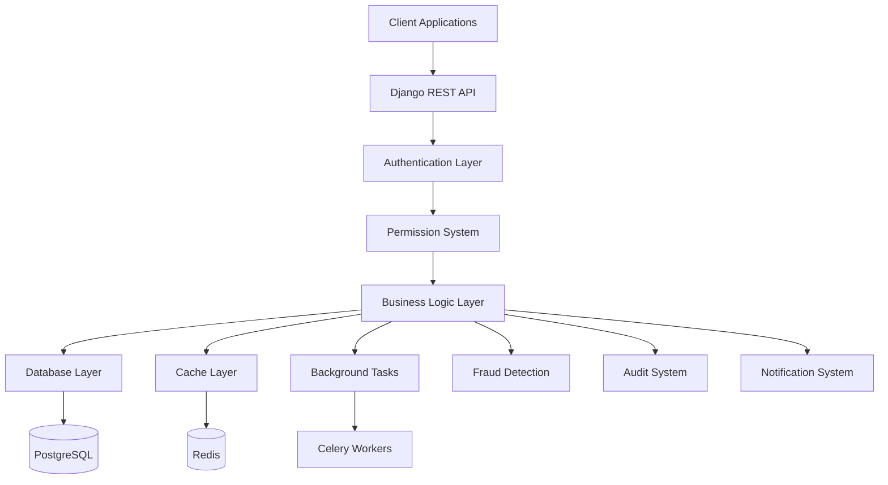
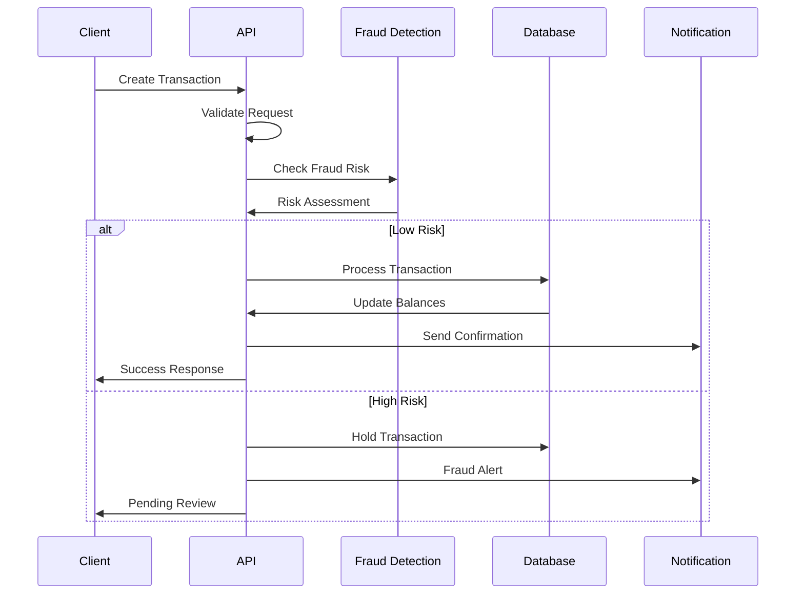

# Core Banking API System

A comprehensive, secure, and scalable banking application built with Django REST Framework and PostgreSQL. This system provides complete banking functionality including user authentication, account management, secure transactions, fraud detection, and administrative tools.

   

## 🌟 Features

### Core Banking Features
- **Multi-Account Support**: Savings, Current, Fixed Deposit accounts
- **Secure Transactions**: Deposits, Withdrawals, Transfers with real-time processing
- **Balance Management**: Real-time balance updates with available balance calculation
- **Transaction History**: Complete audit trail with filtering capabilities
- **Account Statements**: Detailed account statements with date range filtering

### Security & Compliance
- **JWT Authentication**: Secure token-based authentication with refresh tokens
- **Data Encryption**: Sensitive data encrypted using Fernet encryption
- **Fraud Detection**: Advanced AI-powered fraud detection system
- **Rate Limiting**: API rate limiting to prevent abuse
- **Audit Logging**: Comprehensive audit trail for compliance
- **Role-Based Access Control (RBAC)**: Multiple user roles with granular permissions

### Advanced Features
- **Real-time Fraud Alerts**: Automated fraud detection and alerting
- **Risk Scoring**: Dynamic risk assessment for accounts and transactions
- **Multi-factor Security**: Account locking, IP tracking, device fingerprinting
- **Dashboard Analytics**: Comprehensive statistics and reporting
- **Caching**: Redis-based caching for optimal performance
- **Background Tasks**: Celery integration for async operations

## 🏗️ System Architecture



## 🔄 Transaction Flow



## 🚀 Quick Start

### Prerequisites
- Python 3.9+
- PostgreSQL 12+
- Redis 6+
- Git

### 1. Clone Repository
```bash
git clone <repository-url>
cd core_banking
```

### 2. Create Virtual Environment
```bash
python -m venv banking_env
source banking_env/bin/activate  # On Windows: banking_env\Scripts\activate
```

### 3. Install Dependencies
```bash
pip install -r requirements.txt
```

### 4. Database Setup

#### Install PostgreSQL
```bash
# Ubuntu/Debian
sudo apt update
sudo apt install postgresql postgresql-contrib

# macOS
brew install postgresql

# Windows
# Download from https://www.postgresql.org/download/windows/
```

#### Create Database
```bash
sudo -u postgres psql
CREATE DATABASE banking_db;
CREATE USER banking_user WITH PASSWORD 'secure_password';
GRANT ALL PRIVILEGES ON DATABASE banking_db TO banking_user;
\q
```

### 5. Environment Configuration

Create `.env` file in project root:
```env
# Django Settings
SECRET_KEY=your-secret-key-here-change-in-production
DEBUG=True
ALLOWED_HOSTS=localhost,127.0.0.1

# Database Configuration
DB_NAME=banking_db
DB_USER=banking_user
DB_PASSWORD=secure_password
DB_HOST=localhost
DB_PORT=5432

# Redis Configuration
REDIS_URL=redis://localhost:6379/1

# Celery Configuration
CELERY_BROKER_URL=redis://localhost:6379/0
CELERY_RESULT_BACKEND=redis://localhost:6379/0

# Banking Security
ENCRYPTION_KEY=your-32-byte-encryption-key-here!!
```

### 6. Database Migration
```bash
python manage.py makemigrations
python manage.py migrate
```

### 7. Create Superuser
```bash
python manage.py createsuperuser
```

### 8. Start Redis Server
```bash
# Ubuntu/Debian
sudo systemctl start redis-server

# macOS
brew services start redis

# Windows
# Download from https://github.com/tporadowski/redis/releases
```

### 9. Start Celery Worker (Optional)
```bash
celery -A core_banking worker --loglevel=info
```

### 10. Run Development Server
```bash
python manage.py runserver
```

### 11. Access the Application
- **API Root**: http://localhost:8000/
- **Admin Panel**: http://localhost:8000/admin/
- **API Documentation**: http://localhost:8000/api/docs/swagger/
- **Redoc Documentation**: http://localhost:8000/api/docs/redoc/

## 📚 API Documentation

### Authentication Endpoints

| Method | Endpoint | Description | Authentication |
|--------|----------|-------------|----------------|
| POST | `/api/auth/register/` | User registration | None |
| POST | `/api/auth/login/` | User login | None |
| POST | `/api/auth/logout/` | User logout | Required |
| POST | `/api/auth/refresh/` | Refresh token | None |

### Account Management

| Method | Endpoint | Description | Authentication |
|--------|----------|-------------|----------------|
| GET | `/api/accounts/` | List user accounts | Required |
| POST | `/api/accounts/` | Create new account | Required |
| GET | `/api/accounts/{id}/` | Account details | Required |
| PUT | `/api/accounts/{id}/` | Update account | Required |
| GET | `/api/accounts/{id}/balance/` | Account balance | Required |
| GET | `/api/accounts/{id}/statement/` | Account statement | Required |

### Transaction Management

| Method | Endpoint | Description | Authentication |
|--------|----------|-------------|----------------|
| GET | `/api/transactions/` | List transactions | Required |
| POST | `/api/transactions/` | Create transaction | Required |
| GET | `/api/transactions/{id}/` | Transaction details | Required |
| POST | `/api/transactions/{id}/approve/` | Approve transaction | Staff Only |
| POST | `/api/transactions/{id}/reject/` | Reject transaction | Staff Only |

### Quick Access

| Method | Endpoint | Description | Authentication |
|--------|----------|-------------|----------------|
| GET | `/api/profile/` | User profile | Required |
| PUT | `/api/profile/` | Update profile | Required |
| POST | `/api/balance/` | Quick balance check | Required |
| GET | `/api/dashboard/` | Dashboard stats | Required |

## 🔧 Testing the API

### 1. Register a New User
```bash
curl -X POST http://localhost:8000/api/auth/register/ \
  -H "Content-Type: application/json" \
  -d '{
    "username": "testuser",
    "email": "test@example.com",
    "password": "SecurePass123!",
    "confirm_password": "SecurePass123!",
    "first_name": "Test",
    "last_name": "User",
    "phone_number": "+1234567890",
    "date_of_birth": "1990-01-01"
  }'
```

### 2. Login
```bash
curl -X POST http://localhost:8000/api/auth/login/ \
  -H "Content-Type: application/json" \
  -d '{
    "username": "testuser",
    "password": "SecurePass123!"
  }'
```

Save the access token from the response for subsequent requests.

### 3. Create a Bank Account
```bash
curl -X POST http://localhost:8000/api/accounts/ \
  -H "Content-Type: application/json" \
  -H "Authorization: Bearer YOUR_ACCESS_TOKEN" \
  -d '{
    "account_type": "SAVINGS",
    "minimum_balance": "100.00"
  }'
```

### 4. Make a Deposit
```bash
curl -X POST http://localhost:8000/api/transactions/ \
  -H "Content-Type: application/json" \
  -H "Authorization: Bearer YOUR_ACCESS_TOKEN" \
  -d '{
    "transaction_type": "DEPOSIT",
    "to_account_number": "YOUR_ACCOUNT_NUMBER",
    "amount": "1000.00",
    "description": "Initial deposit"
  }'
```

### 5. Check Balance
```bash
curl -X POST http://localhost:8000/api/balance/ \
  -H "Content-Type: application/json" \
  -H "Authorization: Bearer YOUR_ACCESS_TOKEN" \
  -d '{
    "account_number": "YOUR_ACCOUNT_NUMBER"
  }'
```

### 6. Make a Transfer
```bash
curl -X POST http://localhost:8000/api/transactions/ \
  -H "Content-Type: application/json" \
  -H "Authorization: Bearer YOUR_ACCESS_TOKEN" \
  -d '{
    "transaction_type": "TRANSFER",
    "from_account_number": "SOURCE_ACCOUNT_NUMBER",
    "to_account_number": "DESTINATION_ACCOUNT_NUMBER",
    "amount": "100.00",
    "description": "Transfer to friend"
  }'
```

## 🛡️ Security Features

### Data Encryption
- **Sensitive Data**: SSN, addresses, and other PII encrypted using Fernet
- **Password Security**: Django's built-in password hashing
- **JWT Tokens**: Secure token-based authentication

### Fraud Detection
The system includes an advanced multi-layered fraud detection system:

1. **Amount-based Detection**: Flags unusually large transactions
2. **Time-based Analysis**: Detects transactions at unusual hours
3. **Frequency Monitoring**: Identifies rapid transaction patterns
4. **Location Analysis**: IP-based location tracking
5. **Pattern Recognition**: Identifies suspicious behavioral patterns
6. **Risk Scoring**: Dynamic risk assessment for accounts and users

### Rate Limiting
- **Login Attempts**: 5 attempts per minute per IP
- **Registration**: 3 attempts per minute per IP
- **Transactions**: 20 per minute per user
- **Balance Inquiries**: 30 per minute per user

## 👥 User Roles & Permissions

### Customer
- Create and manage own accounts
- Perform transactions on own accounts
- View own transaction history
- Update own profile

### Bank Teller
- View customer accounts
- Process transactions
- Approve/reject pending transactions
- Access basic fraud alerts

### Bank Manager
- All teller permissions
- Manage user accounts
- Access comprehensive reports
- Manage fraud alerts
- View audit logs

### System Administrator
- Full system access
- User role management
- System configuration
- Complete audit trail access

### Auditor
- Read-only access to all transactions
- Complete audit log access
- Fraud alert monitoring
- Compliance reporting

## 🎯 Smart Edge Cases & Features

### 1. Fraud Detection Intelligence
- **Machine Learning Patterns**: Detects unusual spending patterns
- **Velocity Checks**: Monitors transaction frequency and amounts
- **Geographic Analysis**: IP-based location tracking
- **Device Fingerprinting**: Tracks user devices and browsers
- **Risk Profiling**: Dynamic user risk assessment

### 2. Transaction Processing Intelligence
- **Double-spending Prevention**: Ensures transaction atomicity
- **Balance Validation**: Real-time balance checks
- **Daily Limits**: Configurable transaction limits
- **Fee Calculation**: Automatic fee computation
- **Currency Validation**: Supports multiple currencies

### 3. Account Management Features
- **Automatic Account Numbers**: Unique account number generation
- **Interest Calculation**: Automated interest computation
- **Overdraft Protection**: Configurable overdraft limits
- **Account Freezing**: Emergency account suspension
- **Multi-account Support**: Multiple accounts per user

### 4. Security Enhancements
- **Session Management**: Secure session handling
- **Token Blacklisting**: JWT token revocation
- **Account Locking**: Automatic account lockout
- **Audit Trail**: Comprehensive activity logging
- **Encryption**: End-to-end data encryption

### 5. Performance Optimizations
- **Database Indexing**: Optimized database queries
- **Caching Strategy**: Redis-based caching
- **Connection Pooling**: Efficient database connections
- **Background Tasks**: Async processing with Celery
- **Load Balancing**: Horizontal scaling support

## 📊 Monitoring & Analytics

### Dashboard Metrics
- **Customer Dashboard**: Account balances, recent transactions, spending analytics
- **Manager Dashboard**: System-wide statistics, fraud alerts, user activities
- **Admin Dashboard**: System health, performance metrics, security alerts

### Audit & Compliance
- **Transaction Logs**: Complete transaction audit trail
- **User Activity**: Detailed user action logging
- **System Events**: System-level event tracking
- **Compliance Reports**: Regulatory compliance reporting

## 🧪 Testing

### Run Tests
```bash
python manage.py test
```

### API Testing with Postman
1. Import the provided Postman collection
2. Set environment variables (base_url, access_token)
3. Run the collection to test all endpoints

### Load Testing
```bash
# Install locust
pip install locust

# Run load tests
locust -f tests/load_test.py --host=http://localhost:8000
```

## 🚀 Production Deployment

### Environment Setup
```bash
# Production environment variables
DEBUG=False
ALLOWED_HOSTS=yourdomain.com,www.yourdomain.com
SECRET_KEY=your-production-secret-key

# Database (use managed database service)
DB_HOST=your-db-host
DB_NAME=banking_prod
DB_USER=banking_prod_user
DB_PASSWORD=secure-production-password

# Redis (use managed Redis service)
REDIS_URL=redis://your-redis-host:6379

# Security
SECURE_SSL_REDIRECT=True
SESSION_COOKIE_SECURE=True
CSRF_COOKIE_SECURE=True
```

### Docker Deployment
```dockerfile
FROM python:3.9

WORKDIR /app
COPY requirements.txt .
RUN pip install -r requirements.txt

COPY . .

EXPOSE 8000
CMD ["gunicorn", "core_banking.wsgi:application", "--bind", "0.0.0.0:8000"]
```

### Security Checklist
- [ ] Change default secret keys
- [ ] Enable HTTPS/SSL
- [ ] Configure firewall rules
- [ ] Set up monitoring and alerting
- [ ] Regular security audits
- [ ] Database backup strategy
- [ ] Log rotation and archival

## 📈 Performance Optimization

### Database Optimization
- Proper indexing on frequently queried fields
- Connection pooling
- Read replicas for scaling
- Query optimization

### Caching Strategy
- Redis for session storage
- API response caching
- Database query caching
- Static file caching

### Background Processing
- Celery for async tasks
- Email notifications
- Report generation
- Data analytics

## 🐛 Troubleshooting

### Common Issues

#### Database Connection Error
```bash
# Check PostgreSQL status
sudo systemctl status postgresql

# Check database permissions
sudo -u postgres psql -c "\l"
```

#### Redis Connection Error
```bash
# Check Redis status
redis-cli ping

# Should return "PONG"
```

#### Migration Issues
```bash
# Reset migrations (development only)
python manage.py migrate demo_app zero
python manage.py makemigrations demo_app
python manage.py migrate
```

#### JWT Token Issues
- Ensure correct token format: `Bearer <token>`
- Check token expiration time
- Verify token blacklisting

## 📄 API Response Examples

### Successful Login Response
```json
{
  "access": "eyJ0eXAiOiJKV1QiLCJhbGciOiJIUzI1NiJ9...",
  "refresh": "eyJ0eXAiOiJKV1QiLCJhbGciOiJIUzI1NiJ9...",
  "user": {
    "id": 1,
    "username": "testuser",
    "email": "test@example.com",
    "customer_id": "CUST1234567890"
  }
}
```

### Transaction Response
```json
{
  "id": 1,
  "transaction_id": "TXN12345ABC",
  "transaction_type": "TRANSFER",
  "amount": "100.00",
  "fee": "1.00",
  "status": "COMPLETED",
  "from_account": {
    "account_number": "SAV123456",
    "balance": "900.00"
  },
  "to_account": {
    "account_number": "SAV789012",
    "balance": "1100.00"
  },
  "transaction_date": "2024-01-15T10:30:00Z"
}
```

### Error Response
```json
{
  "error": "Insufficient funds",
  "code": "INSUFFICIENT_FUNDS",
  "details": {
    "available_balance": "50.00",
    "requested_amount": "100.00"
  }
}
```

## 🤝 Contributing

1. Fork the repository
2. Create a feature branch (`git checkout -b feature/amazing-feature`)
3. Commit your changes (`git commit -m 'Add amazing feature'`)
4. Push to the branch (`git push origin feature/amazing-feature`)
5. Open a Pull Request

## 📝 License

This project is licensed under the MIT License - see the [LICENSE](LICENSE) file for details.

## 📞 Support

For support and questions:
- Email: support@corebanking.com
- Documentation: [API Docs](http://localhost:8000/api/docs/swagger/)
- Issues: [GitHub Issues](https://github.com/your-repo/issues)

## 🏆 Acknowledgments

- Django REST Framework team
- PostgreSQL community
- Redis community
- Celery project
- All contributors

---

**Built with ❤️ using Django REST Framework**